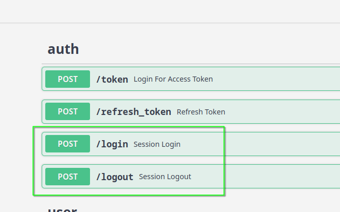
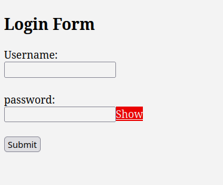
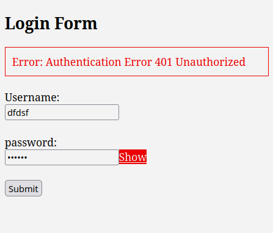
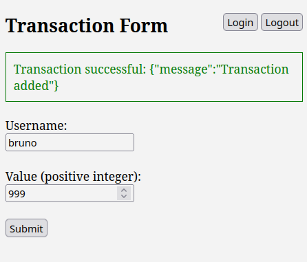

# Front-end e Autenticação

Autenticação consiste em validar as credenciais de um usuário para conceder ou negar acesso a um recurso.

Solicitar as credenciais a cada tentativa de acesso tornaria a experiência do usuário muito desagradável. Por isso, existem dois modelos de persistência de autenticação comumente utilizados quando integrados ao front-end.

Algumas aplicações adotam ambos os modelos simultaneamente, já que é recomendável, e às vezes até necessário, ter mais de um backend de autenticação.

Imagine um cenário em que o aplicativo tem usuários cadastrados diretamente no app (como um usuário administrador, por exemplo), usuários com acesso via token (senhas de app), usuários autenticados através de serviços de diretório como AD/LDAP/Keycloak e provedores de autenticação via OAuth (Google, GitHub, etc.).

Nesse caso, a aplicação pode definir um pipeline de autenticação, chamado de auth backends.

Ex:

[local_users, token, ldap, oath]

No framework Django, por exemplo, configurar esse pipeline de autenticação é bastante simples: basta adicionar as configurações e listar os backends na ordem desejada, sendo que a ordem faz toda a diferença. Já em micro-frameworks como FastAPI, é necessário definir manualmente todo o pipeline.

## Modelo de Persistência

Após o usuário autenticar, independentemente da fase do pipeline em que a autenticação ocorreu, é uma boa prática manter o estado de "autenticado" por um período predefinido, evitando que todo o pipeline tenha que ser executado novamente em cada requisição.

### Sessão

A forma mais tradicional de fazer isso é através de sessões (Session). O conceito é simples:

- O usuário envia as credenciais para um endpoint /login.
- Em caso de sucesso, o servidor gera um ID único para a sessão, como "123456".
- Esse ID é armazenado em algum tipo de storage (memória, banco de dados, cache).
- Além do ID, o servidor também define um timestamp de expiração, por exemplo, 24h (lease time).
- O cliente (navegador) recebe um cookie contendo o ID da sessão "123456".

Assim, tanto no lado do servidor (no storage) quanto no cliente (no cookie) existe a mesma informação: "123456 válido até 16h".

Toda vez que o cliente faz uma requisição, o cookie é enviado ao servidor, que verifica se os dados do cookie coincidem com os do storage e se a validade não expirou.

Opcionalmente, podem ser armazenadas informações adicionais como IP e dispositivo.

```admonish warning
 Existem implicações de segurança nesse modelo que podem ser mitigadas com técnicas de proteção como XSS, CSRF, entre outras.
```

### Token

Este modelo é mais indicado quando já existe uma estrutura de autenticação por token (como no nosso caso), e a preferência é deixar a implementação a cargo do front-end.

O fluxo de trabalho é o seguinte:

- O usuário faz login por meio de um formulário em /login.html.
- O formulário envia as credenciais para o endpoint /token e recebe um token e um refresh token.
- O front-end armazena esses dados em um cookie ou local storage.
- A cada requisição, o front-end valida a expiração do token, verifica a necessidade de refresh e
  adiciona o token nos headers da requisição.

Este modelo não exige o armazenamento de sessões no servidor, já que não há sessão. O próprio token contém as informações de expiração, e essas informações estão assinadas.


## Upgrade do ambiente

No terminal fora do container

```bash
pip-compile requirements.in --upgrade --resolver=backtracking

docker compose down
docker compose build api
docker compose up
```

## Implementando Session no FastAPI


### Session storage

Primeiro precisamos definir onde guardaremos as sessions, para nossa
sorte já temos o Redis em nossa infraestrutura e podemos usar.

Começamos estabelecendo algumas configurações em `default.toml`


```toml
[default.session_store]
host = "@get redis.host"
port = "@get redis.port"
db = 1
expiration = "@int @jinja {{60 * 60 * 24 * 7}}"
```

Criando funções de gestão de session.

`dundie/session.py`

```python
from __future__ import annotations

from uuid import uuid4
from dundie.config import settings
from redis import Redis

EXPIRATION = settings.session_store.get("expiration", 60 * 60 * 24)

session_store = Redis(
    host=settings.session_store.host,
    port=settings.session_store.port,
    db=settings.session_store.db,
)


def set_session(username) -> str:
    """Creates a new random session"""
    session_id = uuid4().hex
    session_store.set(session_id, username, ex=EXPIRATION, nx=True)
    return session_id


def get_session(session_id) -> bool | str:
    """Get data from a session_id"""
    session_data = session_store.get(session_id)
    return session_data and session_data.decode()

```

Quando o usuário fizer login através de um formulário vamos
criar a sessão usando `set_session` e vamos isso diretamente no
FastAPI e depois submeter um formulário com HTML.

### Session login


E, `routes/auth.py` vamos adicionar:


```python
from fastapi import ..., Form, Request
from fastapi.responses import Response
from dundie.session import set_session, session_store

...


# session auth

@router.post("/login")
async def session_login(
    response: Response,
    username: str = Form(),
    password: str = Form(),
):
    """Cookie Based Session Auth Login"""
    user = authenticate_user(get_user, username, password)
    if not user or not isinstance(user, User):
        raise HTTPException(
            status_code=status.HTTP_401_UNAUTHORIZED,
            detail="Incorrect username or password",
        )
    session_id = set_session(user.username)
    response.set_cookie(key="session_id", value=session_id, domain="localhost")
    return {"status": "logged in"}


@router.post("/logout")
async def session_logout(request: Request, response: Response):
    """Cookie Based Session Auth Logout"""
    if session_id := request.cookies.get("session_id"):
        response.delete_cookie(key="session_id")
        session_store.delete(session_id)
    return {"status": "logged out"}

```

### Ajustando as dependencias de auth

`dundie/auth.py`

```python
from dundie.session import get_session
...

oauth2_scheme = OAuth2PasswordBearer(tokenUrl="token", auto_error=False)

...


def get_current_user(
    request: Request, token: str = Depends(oauth2_scheme), fresh=False  # pyright: ignore
) -> User:
    """Get current user authenticated"""
    credentials_exception = HTTPException(
        status_code=status.HTTP_401_UNAUTHORIZED,
        detail="Could not validate credentials",
        headers={"WWW-Authenticate": "Bearer"},
    )

    if request:
        if session_id := request.cookies.get("session_id"):
            username = get_session(session_id)
            if not username:
                raise HTTPException(status_code=status.HTTP_401_UNAUTHORIZED, detail="Invalid Session ID")
            user = get_user(username=username)
            if user is None:
                raise HTTPException(status_code=status.HTTP_401_UNAUTHORIZED, detail="Session user not found")
            return user


        if authorization := request.headers.get("authorization"):
            try:
                token = authorization.split(" ")[1]
            except IndexError:
                raise credentials_exception

    if not token:
        raise credentials_exception

    try:
        payload = jwt.decode(
            token, SECRET_KEY, algorithms=[ALGORITHM]  # pyright: ignore  # pyright: ignore
        )
        username: str = payload.get("sub")  # pyright: ignore

        if username is None:
            raise credentials_exception
        token_data = TokenData(username=username)
    except JWTError:
        raise credentials_exception
    user = get_user(username=token_data.username)
    if user is None:
        raise credentials_exception
    if fresh and (not payload["fresh"] and not user.superuser):
        raise credentials_exception

    return user
```

Agora em [http://localhost:8000/docs](http://localhost:8000/docs)




### Form HTML

Agora precisamos de um formulário HTML para postar as credenciais de login.

`ui/login.html`

```html
<!DOCTYPE html>
<html lang="en">
<head>
    <meta charset="UTF-8">
    <meta name="viewport" content="width=device-width, initial-scale=1.0">
    <title>Login Form</title>
    <style>
        #message {
            margin-bottom: 20px;
            padding: 10px;
            border: 1px solid transparent;
            display: none;
        }
        #message.success {
            border-color: green;
            color: green;
        }
        #message.error {
            border-color: red;
            color: red;
        }
    </style>
</head>
<body>
    <h2>Login Form</h2>

    <div id="message"></div> <!-- Message div -->

    <form id="loginForm">
        <label for="username">Username:</label><br>
        <input type="text" id="username" name="username" required><br><br>

        <label for="password">password:</label><br>
        <input type="password" id="password" name="password" required><br><br>

        <button type="submit">Submit</button>
    </form>

    <script>

        const messageDiv = document.getElementById('message');
        function reset_message_div() {
            // Reset the message div
            messageDiv.style.display = 'none';
            messageDiv.classList.remove('success', 'error');
        }

        document.getElementById('loginForm').addEventListener('submit', function(event) {
            event.preventDefault();  // Prevent the default form submission

            const formData = new FormData();
            formData.append("username", document.getElementById("username").value);
            formData.append("password", document.getElementById("password").value);

            reset_message_div();

            const url = `http://localhost:8000/login`;
            fetch(url, {
                method: 'POST',
                body: formData,
                credentials: 'include'
            })
            .then(response => {
                if (response.status >= 400 && response.status <= 500) {
                    throw new Error(`Authentication Error ${response.status} ${response.statusText}`);
                }
                return response.json();
            })
            .then(data => {
                location.href = "/add.html"
            })
            .catch((error) => {
                console.error('Error:', error);
                messageDiv.textContent = error;
                messageDiv.classList.add('error');
                messageDiv.style.display = 'block';
            });
        });
    </script>
</body>
</html>

```

Agora em [http://localhost:8001/login.html](http://localhost:8001/login.html)






## Transaction HTML

`ui/add.html`
```html
<!DOCTYPE html>
<html lang="en">
<head>
    <meta charset="UTF-8">
    <meta name="viewport" content="width=device-width, initial-scale=1.0">
    <title>Transaction Form</title>
    <style>
        #message {
            margin-bottom: 20px;
            padding: 10px;
            border: 1px solid transparent;
            display: none;
        }
        #message.success {
            border-color: green;
            color: green;
        }
        #message.error {
            border-color: red;
            color: red;
        }
        nav#controls {
            float: right;
        }
    </style>
</head>
<body>
    <nav id="controls">
        <button id="login" onclick="login()">Login</button>
        <span>
        <button id="logout" onclick="logout()">Logout</button>
    </nav>

    <h2>Transaction Form</h2>

    <div id="message"></div> <!-- Message div -->

    <form id="transactionForm">
        <label for="username">Username:</label><br>
        <input type="text" id="username" name="username" required><br><br>

        <label for="value">Value (positive integer):</label><br>
        <input type="number" id="value" name="value" min="1" required><br><br>

        <button type="submit">Submit</button>
    </form>

    <script>
        function getCookie(name) {
            let cookies = document.cookie.split(';');
            for(let i = 0; i < cookies.length; i++) {
                let cookie = cookies[i].trim();
                if (cookie.startsWith(name + '=')) {
                    return cookie.substring(name.length + 1);
                }
            }
            return null;
        }

        function checkSessionLogin() {
            let sessionCookie = getCookie("session_id");
            if (!sessionCookie) {
                window.location.href = "/login.html";
            }
        }

        checkSessionLogin();

        const messageDiv = document.getElementById('message');
        function reset_message_div() {
            // Reset the message div
            messageDiv.style.display = 'none';
            messageDiv.classList.remove('success', 'error');
        }

        function logout() {
            fetch('http://localhost:8000/logout', {
                method: 'POST',
                credentials: 'include'
            })
            .then(response => {
                location.href = "/login.html"
            })
            .catch((error) => {
                console.error('Error:', error);
                messageDiv.textContent = error;
                messageDiv.classList.add('error');
                messageDiv.style.display = 'block';
            });
        }
        function login() {
            location.href = "/login.html"
        }

        document.getElementById('transactionForm').addEventListener('submit', function(event) {
            event.preventDefault();  // Prevent the default form submission

            const username = document.getElementById('username').value;
            const value = document.getElementById('value').value;

            reset_message_div();

            if (value <= 0) {
                messageDiv.textContent = 'Please enter a positive integer for the value.';
                messageDiv.classList.add('error');
                messageDiv.style.display = 'block';
                return;
            }

            const url = `http://localhost:8000/transaction/${username}/`;
            const data = { value: parseInt(value) };

            fetch(url, {
                method: 'POST',
                headers: {
                    'Content-Type': 'application/json',
                },
                body: JSON.stringify(data),
                credentials: 'include'
            })
            .then(response => {
                if (response.status >= 400 && response.status <= 500) {
                    throw new Error(`Authentication Error ${response.status} ${response.statusText}`);
                }
                return response.json();
            })
            .then(data => {
                messageDiv.textContent = 'Transaction successful: ' + JSON.stringify(data);
                messageDiv.classList.add('success');
                messageDiv.style.display = 'block';
            })
            .catch((error) => {
                console.error('Error:', error);
                messageDiv.textContent = error;
                messageDiv.classList.add('error');
                messageDiv.style.display = 'block';
            });
        });
    </script>
</body>
</html>
```

Agora em [http://localhost:8001/add.html](http://localhost:8001/add.html)



